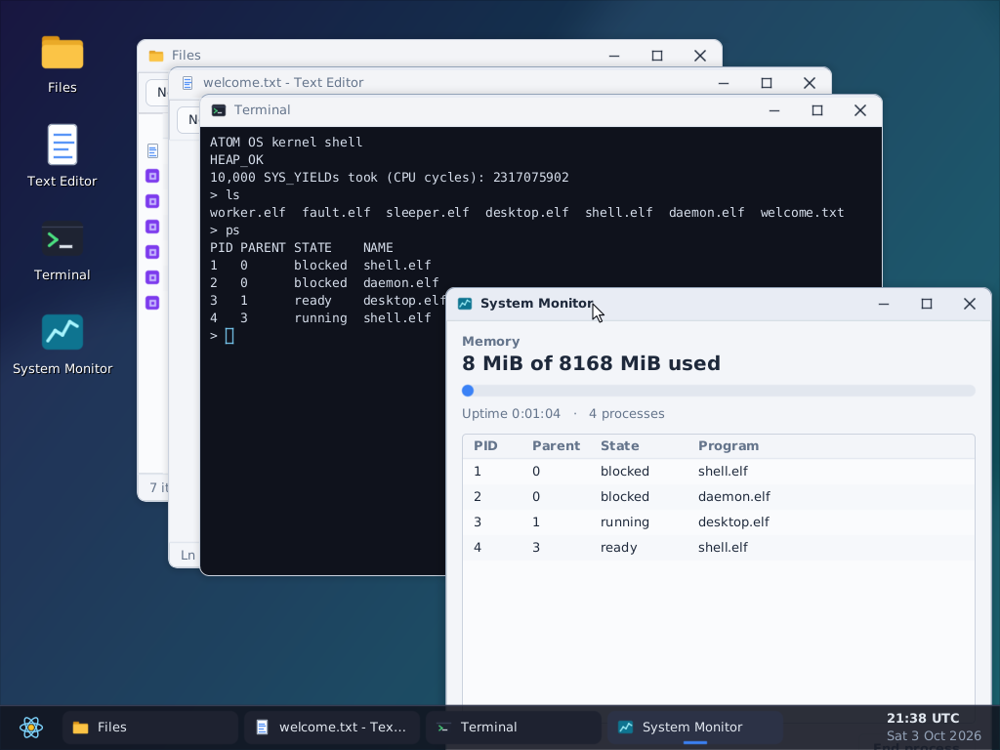

# Atom OS Kernel

An experimental x86-64 operating-system kernel written in Rust, with a graphical
desktop, a command shell, isolated user processes, pipes, a real userspace heap,
IPC, and persistent files on a virtual block device.



This repository contains the kernel, userspace runtime, bundled programs, and
build and verification tools. Its core library defines eight root operations:
**scan, hash, fold, project, scale, compare, combine, and order**. Their definitions
live in [`kernel-kit/src/atoms.rs`](kernel-kit/src/atoms.rs); the kernel and
orchestrator compose mechanisms around them.

**Current stage:** a bootable development kernel verified in QEMU with KVM and
software emulation. Hardware installation and multiprocessor operation have not
been validated.

[Verified results](#verified-results) · [Build and test](#build-and-test) ·
[Desktop](#desktop) · [Shell commands](#shell-commands) · [Architecture](#architecture) ·
[Current limits](#persistent-storage-and-current-limits) · [Next milestones](#next-milestones)

## What works

- **Graphical desktop:** a 32-bit desktop that adapts to the display, from 1024×768
  up to 6K (6144×3456), with HiDPI scaling (2× at 4K, 3× at 6K) and overlapping windows,
  a taskbar, a start menu and a mouse pointer. It includes a file manager, a
  text editor with a file picker, a terminal, a system monitor and an About
  window; see [Desktop](#desktop).
- **Input:** PS/2 keyboard with Shift, Caps Lock, Ctrl, Alt, arrows and
  function keys, and a PS/2 mouse with a scroll wheel.
- **Protected processes:** private address spaces, validated ELF loading,
  write/execute permissions, stack guards, and checked syscall buffers.
- **Process lifecycle:** `spawn`, parent-owned `wait`, exit status, sleeping,
  argument passing, process inspection, explicit termination, orphan cleanup,
  and resource reclamation after a process stops using its
  address space and kernel stack.
- **Physical memory:** every usable RAM region from the boot memory map,
  including RAM above QEMU's 4 GiB PCI hole; the test VM boots with 8 GiB.
- **Memory allocation:** a kernel slab allocator with reusable large/aligned
  allocations, plus a Rust userspace allocator with small-object size classes
  over mapped private pages.
- **Scheduling and syscalls:** round-robin preemption, `int 0x80` and fast
  `syscall/sysret` paths, and saved integer/x87/SSE/MXCSR context.
- **Files and IPC:** a filesystem with folders and paths, files up to 1 GiB held in
  page frames (not the kernel heap), bulk read/write/seek calls, removal and moves
  that refuse to touch open or built-in files, read-only embedded programs in
  `/bin`, a per-process working folder, numbered error reasons (`SYS_FS_ERROR`),
  saved-state reporting, and bounded per-process message queues.
- **Process control:** `ps` lists live and exited processes with their parent,
  state and program name; `kill` ends a process, whose parent then collects
  status **137**.
- **Arguments and pipes:** programs start with arguments (a packed argv, or one
  argument string) and a chosen standard input and output (the console or a
  pipe). The kernel redirects output, `ls` and `clear` into pipes, so the
  unmodified shell runs inside the desktop terminal. Writers to a pipe without
  readers exit with status **141**.
- **Persistent storage:** a copy-on-write disk format: a save writes only the files
  that changed, never overwrites the saved generation, and survives a power cut at
  any step. Files load from disk when first opened and are checked against their
  saved checksum. Disks in the earlier snapshot format (flat or folder tree) are
  imported. The virtio-blk driver moves up to 128 KiB per request, and completed
  I/O errors can be retried.
- **Diagnostics:** serial crash reports and containment of user faults, with a
  dedicated fault probe that verifies the shell survives.

## Verified results

The latest VM verification was completed on **September 17, 2026**. These are
recorded results from the development VM, not a claim that every later CI run
has passed. The earlier September 5 baseline remains preserved in test history.

| Verification | Recorded result |
|---|---|
| Native regression suite | **32 passed, 0 failed** |
| QEMU with KVM | **21 acceptance checks passed**; acceleration confirmed by QMP |
| QEMU with TCG software emulation | **21 acceptance checks passed** on the same boot image |
| Process creation, wait, and reaping | **48 measured cycles** per backend, following warmup |
| Forced termination and reaping | **48 additional cycles** per backend with open unlinked files and live heap allocations |
| Free frames after process churn | **16,321 before → 16,321 after** on both backends |
| Persistent files | Exact generated text survived a warm OS reboot and a fresh QEMU cold boot |
| Executable replacement | Worker replaced the shell, exited, and left the daemon running |
| Interrupted storage / I/O failures | **7 cases passed per backend**, at a full 512 KiB serialized snapshot |
| Interactive console | **2 sessions per backend**, exact retained contents and exclusive-image locking |

**October 3, 2026 update:** with the desktop, pipes and 8 GiB of RAM, the
native suite recorded **28 passed, 0 failed**, the text acceptance suite
recorded **20 checks passed**, and the new desktop acceptance suite recorded
**10 checks passed**, all under QEMU 8.2.2 with TCG (KVM was not available).
Those logs were not committed; GitHub Actions runs both suites on every push.

**Filesystem update (same day):** with folders, large files and the copy-on-write
disk format, the native suite recorded **28 passed** (including a power cut at every
write step of a save), the text suite **23 checks passed** (folders, a 3 MB file
written, copied, checksummed and read back after a reboot) and the desktop suite
**11 checks passed** (saving into a folder and browsing folders in the picker).


The acceptance suite also exercises keyboard input, file reads/writes, exact IPC
delivery, concurrent processes, invalid-pointer/ELF rejection, fast syscalls,
SIMD state across timer preemption, and a contained user page fault.
The recovery suite additionally suspends actual virtio requests at QEMU block
breakpoints, terminates the OS guest, and cold-boots the same test disk. It
checks payload writes, payload flushes, header writes and header flushes, plus
retry after injected I/O and host-space errors. This exercises abrupt guest
termination; it does not model a physical host losing its disk cache.

Evidence:

- [Combined verification record](test-results/run-20260917T212634980705680Z/verification.json)
- [Native test output](test-results/run-20260917T212634980705680Z/native.log)
- [KVM acceptance result](test-results/run-20260917T212634980705680Z/acceptance/result.json)
- [TCG acceptance result](test-results/run-20260917T212634980705680Z/tcg-acceptance/result.json)
- [Cold-boot serial transcript](test-results/run-20260917T212634980705680Z/acceptance/cold/serial.log)
- [Program arguments and process-control report](test-results/process-controls-20260917/REPORT.md)
- [Filesystem and session implementation report](test-results/durable-file-session-20260917/REPORT.md)
- [KVM recovery cases](test-results/run-20260917T212634980705680Z/recovery/result.json)
- [TCG recovery cases](test-results/run-20260917T212634980705680Z/tcg-recovery/result.json)
- [Interactive console results](test-results/run-20260917T212634980705680Z/console-process/result.json)

The reference environment was Ubuntu 24.04.4 on x86-64 with QEMU 8.2.2,
bootimage 0.10.5, and Rust `1.100.0-nightly (8fa1c96cf 2026-08-17)` from the
pinned `nightly-2026-08-18` toolchain. Compiler warnings remain in the low-level
code; the build is not described as warning-free.

## Build and test

### Prepare an x86-64 Linux environment

Install [rustup](https://rust-lang.github.io/rustup/installation/index.html)
first. On Ubuntu/Debian, install the host tools and the pinned Rust components:

```sh
sudo apt-get update
sudo apt-get install -y build-essential git python3 qemu-system-x86

rustup toolchain install nightly-2026-08-18 --profile minimal \
  --component rust-src --component llvm-tools-preview

# Install this host tool from outside a Cargo workspace.
cargo +nightly-2026-08-18 install bootimage --version 0.10.5 --locked
```

The toolchain is pinned in [`rust-toolchain.toml`](rust-toolchain.toml). Use the
pinned version when reproducing the recorded results.

### Clone, build, and run acceptance

Authenticate with an account that has access to this private repository before
cloning:

```sh
git clone https://github.com/Rekonquest/atom-os-kernel.git
cd atom-os-kernel

bash scripts/build.sh
bash scripts/test-native.sh
python3 scripts/boot-test.py --accel tcg --output test-results/local-tcg
python3 scripts/test-storage-recovery.py --accel tcg --output test-results/local-recovery
python3 scripts/test-console.py --accel tcg --output test-results/local-console
python3 scripts/desktop-test.py --accel tcg --output test-results/local-desktop
```

To use the desktop yourself, open it in a QEMU window. Files you save to disk
are kept in `target/atom-data.img` between runs:

```sh
bash scripts/run-desktop.sh                            # Full HD
ATOM_RESOLUTION=3840x2160 bash scripts/run-desktop.sh  # 4K, UI at 2x
ATOM_RESOLUTION=6144x3456 bash scripts/run-desktop.sh  # 6K, UI at 3x
```

The kernel reads the monitor's preferred mode from its EDID (including the DisplayID
block that 5K and 6K displays use) and uses it if the adapter's video memory and mode
limits allow; otherwise it takes the largest standard mode that fits. Without EDID it
stays at Full HD or below. The desktop then picks an integer UI scale so the
interface keeps the same physical size: shapes and text are drawn at the higher
resolution, not stretched.

[`build.sh`](scripts/build.sh) builds the shell, daemon, worker, fault probe
and desktop before embedding them in the kernel. The resulting boot image is:

```text
target/x86_64-os/release/bootimage-x86_64-kernel.bin
```

Use [`test-native.sh`](scripts/test-native.sh) for native checks,
[`boot-test.py`](scripts/boot-test.py) for text-console acceptance and
[`desktop-test.py`](scripts/desktop-test.py) for the desktop. The acceptance
runs are headless and boot the guest with 8 GiB of RAM (`--memory` changes
this). `boot-test.py` runs without a display device, so the shell stays in
text mode, and injects keyboard input through QMP. `desktop-test.py` boots with
a virtual monitor of `--resolution` (default 1920x1080; 3840x2160 and 6144x3456 are
also tested), drives the desktop with QMP mouse and keyboard events, and saves
PNG screenshots of each step. Both record serial output and machine-readable
results. Each run requires a **new output directory**, creates
an isolated **8 MiB test disk**, and stops its QEMU instances when finished.

For hardware acceleration on a machine with KVM available:

```sh
python3 scripts/boot-test.py --accel kvm --output test-results/local-kvm
```

The KVM path requires access to `/dev/kvm`. If direct access is unavailable, the
script attempts its existing passwordless `sudo -n setpriv` route using the
`kvm` group. That fallback must already be permitted on the machine. TCG does
not require KVM access.

For builds using cached dependencies only:

```sh
ATOM_OFFLINE=1 bash scripts/build.sh
```

### Existing `atom-os-dev` development VM

The maintainer's dedicated VM is already configured for this project. From its
host machine, run:

```sh
bash scripts/vm-test.sh
```

This wrapper uses the libvirt system connection, the `atom-os-dev` VM and SSH
alias, and `/home/jesse/atom-os-kernel-tests` inside that VM. It starts the VM if
needed, copies the current working tree into a new timestamped directory,
builds and tests it, and retrieves the results under `test-results/run-*`.
`test-results/latest-run.txt` records the latest local result directory.

The wrapper is specific to that existing setup; the direct Linux commands above
are the starting point for another machine. It preserves previous runs and the
original VM workspace, and runs native, boot, recovery and console checks.

### Interactive session with a continuing disk

From the configured host:

```sh
bash scripts/vm-run.sh
```

This builds the current tree in `atom-os-dev` and opens the OS serial console.
Type commands normally, including `>` for redirection. The default data disk is
`~/.local/share/atom-os-kernel/data.img` **inside the VM**, reused across launches.
Use `sync` to save; press **Ctrl-a, then x** to leave QEMU. An existing image is
never truncated, and a second simultaneous session using that image is refused.
The default session starts with an empty 8 MiB image when none exists.

Inside a prepared build environment, the equivalent launcher is:

```sh
python3 scripts/run.py --accel kvm
```

Both launchers accept `--disk /path/to/data.img` and `--accel tcg`. Disk paths
passed to `vm-run.sh` refer to the VM. Changes made after the last successful
`sync` remain in RAM and are lost on exit. The daemon keeps an active shell's
prompt quiet; its standalone heartbeat remains available after the shell exits.

### Buffered IPC and executable preflight

The build now validates every embedded userspace executable with the kernel's
own ELF parser before producing the boot image. `user_rt::receive_into` provides
allocation-free, caller-owned IPC messages; the daemon uses it, and short
buffers are rejected without consuming a queued message.

Run `bash scripts/vm-test-userspace.sh` on the configured host for focused native,
KVM and TCG verification. See [userspace reuse](docs/USERSPACE-REUSE.md) for the API,
source provenance, acceptance cases, and compatibility decisions.

## Desktop

When a display device is present (QEMU `-vga std`), the console shell starts
[`desktop.elf`](desktop/src/main.rs) at boot. **Exit to console** in the start
menu returns to the text shell, and the `desktop` command re-enters it.

| Part | What it does |
|---|---|
| Windows | Move by the title bar, resize from the corner grip, maximise (or double-click the title), minimise and close. Dialogs are modal. |
| Taskbar | Start button, one button per window (click to focus or minimise), and a UTC clock read from the CMOS clock. |
| Start menu | Launch apps, **Save all to disk**, **Exit to console** and **Restart**. The Super key also opens it. |
| Files | Browse folders (Up, Backspace or Alt+Up goes up), with sizes, types and unsaved changes. New file, New folder, Open, Rename, Delete and **Save to disk**; the status bar shows disk use. Double-click enters folders, opens documents in the editor and runs programs in a terminal window. |
| Text Editor | Line numbers, selection with Shift or the mouse, Ctrl+A/C/X/V, Ctrl+S, Ctrl+Shift+S, Ctrl+O, Ctrl+N and auto-indent. **Save writes to the data disk.** Files up to 16 MB. |
| File picker | Modal **Open** and **Save As** dialogs that browse folders: Up, double-click a folder, or type a folder name or a path such as `docs/report.txt` or `..`. Save As can make a new folder. |
| Terminal | Runs `shell.elf` (or a program opened from Files) over pipes, with 2,000 lines of scrollback. |
| System Monitor | Memory use, uptime and the process table, with **End process**. |

Keyboard shortcuts: Alt+F4 closes the focused window, Alt+Tab switches windows
and Esc cancels dialogs.

### How the desktop is rendered

The desktop renders through **pmre-kit**, the primitive kit of the Atom Rendering
Engine, copied into [`third_party/atom-rendering-engine`](third_party/atom-rendering-engine)
so the build is self-contained (no git pins, no symlinks, no paths outside this
repository). The kit does all rasterization on the CPU:

- shapes (rectangles, rounded rectangles, circles, lines, and one-pixel rounded
  outlines) are signed-distance fields with analytic anti-aliasing, and soft shadows
  and glows use its widened AA band;
- only edge pixels evaluate the distance field: the fully covered interior of each row
  is a single span, which the back buffer fills as a bulk row write;
- icon curves and the pointer are filled and stroked by its scanline path rasterizer;
- text is rasterized from TrueType outlines by its built-in parser, using the DejaVu
  subsets in [`desktop/fonts`](desktop/fonts).

The desktop is the orchestrator: it decides draw order, clipping and what changed,
and draws into a back buffer that implements the kit's `Surface`. Only the changed
region is re-rendered, and each window is clipped to the parts not covered by
windows above it. The finished region is copied to the linear framebuffer.

The two patches in `third_party/atom-rendering-engine/patches` add a `std` feature so
the kit builds without the standard library, the span fast path and outline shapes,
and opt-out `uxi`/`html` features; the desktop turns all three off, so it compiles only
the drawing primitives, not the engine's widget layer or HTML pipeline. With the span
path, a desktop frame under QEMU software emulation dropped from 210–730 ms to 10–50 ms.
[`update-engine.sh`](scripts/update-engine.sh) refreshes the copy from the engine
repository when you want its latest improvements.

## Shell commands

| Command | Behavior |
|---|---|
| `help`, `clear` | List commands or clear the screen |
| `ls [folder]`, `cd [folder]`, `pwd` | List a folder (sizes, unsaved files), change or show the current folder |
| `mkdir folder`, `rmdir folder` | Create a folder, or remove an empty one |
| `cat file` | Read a file |
| `cp from to`, `mv from to` | Copy, or rename/move a file or folder; a folder as `to` means "into it" |
| `rm path` | Remove a file no process has open, or an empty folder |
| `echo text > file` | Append text and a newline |
| `edit file` | Edit up to 64 KiB on the console; Esc saves the RAM copy (atomic replace) |
| `rm file` | Remove a file or empty folder; a file open in any process is refused ("in use") |
| `mv old new` | Rename or move; an existing folder destination means "into that folder" |
| `df` | Disk size, space used, and whether anything is unsaved |
| `status` | One-line saved state, sizes, generation and disk availability (`FS_STATUS ...`) |
| `fill file bytes`, `sum file` | Write a large test file / print a file's size and checksum |
| `msg text` | Send a message to the daemon; a full mailbox returns an error |
| `bench`, `heaptest`, `stats` | Exercise yields/heap or show free frames and live tasks |
| `spawn worker.elf [arguments...]` | Start a child with arguments while the shell continues; print its PID |
| `wait PID` | Wait for a child of this shell and collect its exit status |
| `run worker.elf [arguments...]` | Start the program and keep the shell (same as `spawn`) |
| `exec worker.elf [arguments...]` | Replace the shell with the executable and arguments, retaining its PID |
| `ps` | Snapshot PID, parent PID, state and program name; uncollected exits remain visible |
| `kill PID` | Immediately terminate a live process; its parent can collect status **137** with `wait` |
| `proctest` | Exercise argument limits, bad pointers, exec, process inspection, kill/wait and cleanup |
| `demos` | Run the security demo fleet (E21–E38) and return when it is done (at most 60 s); once per boot, since the demo keys have one life per boot |
| `selftest`, `pairtest` | Run one worker or two concurrent workers and check their exits |
| `churn 48` | Exercise repeated process creation/reaping and compare free-frame counts |
| `fstest` | Exercise file lifecycle and full-capacity checks on an empty filesystem with a disk |
| `faulttest` | Confirm a user page fault terminates that worker while the shell survives |
| `desktop` | Start the graphical desktop and wait until it exits |
| `sync` | Save every change to the data disk |
| `reboot` | Sync successfully, then reboot the OS |

Program launches accept single/double quotes, empty quoted arguments, and
backslash escaping outside single quotes. For example:

```text
spawn worker.elf --args "two words" ''
spawn worker.elf --sleep
ps
kill 4
wait 4
```

The [keyboard decoder](kernel-kit/src/input.rs) handles Shift, so `>` and `|`
are typed normally. The numpad `+` key still enters `>`, as before.

Use the actual PID printed by `spawn` in place of `4`. `worker.elf --args` prints
its arguments and exits with status 41; `--sleep` is a long-lived diagnostic.
`exec` replaces the shell; `run` and `spawn` keep the prompt. Invalid quoting or
arguments are rejected. A process has one argv: at most 16 UTF-8 arguments
including the executable name (`argv[0]`), and 1024 bytes including NUL
separators, read with `user_rt::args()`. `spawn_with` (which also chooses the
child's stdin and stdout, as the desktop terminal does) takes the arguments as
one string and the kernel splits it with the shell's quoting rules; a string
that would exceed the argv limits is refused rather than truncated. Arguments
are copied into the kernel before launch, and rejected exec requests leave the
old image intact.

`ps` uses one validated, fixed-capacity snapshot; states are ready, running,
sleeping, waiting, exited, or trapped. `kill` is immediate termination, not a
catchable signal. It shares exit/wait cleanup, including orphan handling and
deferred reclamation of an active kernel stack/address space. There are no user
identities or permissions yet: **any process can kill any live user process,
including the shell or daemon**. PID 0, unknown PIDs and already-exited PIDs are
rejected. Process inspection and control are not security authorization boundaries.

The serial console accepts normal terminal input; arrow keys move the cursor in
the shell's line editor on both the serial console and the keyboard.

Paths are relative to the current folder (the prompt shows it); `..` goes up.
Changes made in the shell are saved to disk by `sync` (the desktop editor saves
on Save). Built-in programs live read-only in `/bin` and run by bare name
(`spawn worker.elf`); a file held open by any process cannot be removed.

The kernel embeds the shell, the daemon, the desktop, the security and network
demo programs, the userspace citizens (`hello.elf`, `sysinfo.elf`, `netstat.elf`,
`calc.elf`, `udpsend.elf`) and the diagnostics. The diagnostic worker checks heap
contents, untrusted pointers, file handles, fast syscalls, SIMD context and IPC,
then exits with status **37**. It also checks remove/rename rules, its own
process-list entry, and spawns itself with arguments, reading the child's output
through a pipe. `sleeper.elf` sleeps until killed, for `ps`/`kill` tests. The
fault probe touches a stack guard page and produces status **142**, which its
parent checks. `fs-probe.elf` exercises the file lifecycle and error reasons,
folders and the working folder, and saved-state tracking. The `storageprobe`
diagnostic command supports `seed`, `mutate` and `verify` with a 16-hex-digit
nonce for isolated recovery-test disks.

The shared syscall definitions are in [`abi.rs`](abi.rs). Existing byte-I/O and
IPC calls remain available alongside the newer process and memory operations.
`SYS_ALLOC` returns mapped process-private memory; `SYS_FREE` releases it.
`SYS_REMOVE` and `SYS_RENAME` take NUL-terminated names. `SYS_PROCESSES` copies
fixed 64-byte records into a checked, writable user buffer, and `SYS_KILL`
terminates a process by PID.

| Area | Calls |
|---|---|
| Arguments and pipes | `SYS_SPAWN_WITH`, `SYS_ARGS`, `SYS_PIPE`, `SYS_PIPE_READ`, `SYS_PIPE_WRITE`, `SYS_PIPE_CLOSE`, `SYS_STDIN_READ`, `SYS_CONSOLE_WRITE`; `SYS_EXEC` accepts arguments |
| Display and input | `SYS_DISPLAY_PRESENT`, `SYS_DISPLAY_OPEN` (maps the framebuffer and makes the caller the only input receiver), `SYS_DISPLAY_CLOSE`, `SYS_INPUT_POLL` |
| Information | `SYS_LIST_FILES`, `SYS_MEMORY_TOTAL`, `SYS_TIME` (CMOS clock, Unix seconds) |

## Architecture

| Location | Responsibility |
|---|---|
| [`x86_64-kernel/`](x86_64-kernel) | Boot entry, CPU/interrupt setup, context activation, program embedding and crash diagnostics |
| [`kernel-kit/`](kernel-kit) | Root atoms, allocation, address spaces, ELF validation, filesystem, pipes, display, input, clock, hardware I/O and storage |
| [`kernel-orchestrator/`](kernel-orchestrator) | Scheduling, process loading/lifecycle and syscall dispatch |
| [`user-rt/`](user-rt) | Userspace entry, syscall wrappers, console helpers and allocator |
| [`payload/`](payload) | Command shell |
| [`desktop/`](desktop) | Graphical desktop: window manager, widgets, apps and embedded fonts |
| [`third_party/atom-rendering-engine/`](third_party/atom-rendering-engine) | Copy of the Atom Rendering Engine's `pmre-kit`, the desktop's renderer |
| [`daemon/`](daemon) | IPC receiver and heartbeat process |
| [`worker/`](worker) | Diagnostic worker, fault-probe and sleeper executables |
| [`tests/`](tests) and [`scripts/`](scripts) | Native regression tests, builds and VM acceptance |

Each process owns its image, stacks, heap allocations, receive page and copied
page-table paths. Kernel mappings remain supervisor-only. The loader validates
ELF headers and ranges before mapping; syscall buffers are checked before use.
The scheduler releases exited resources only after their CR3 and kernel stack
are inactive. Exit status remains available to the parent until `wait`, and
orphaned exits are collected automatically.

The [design document](ATOM-STACK-KERNEL-DESIGN.md) and [working notes](NOTES.md)
retain the project's architecture reasoning and historical investigations.
Their dated plans and earlier failure states should be read alongside the
current source and verification evidence.

### Atom architecture: intent and current enforcement

The eight root atom definitions remain unchanged by the process-control work.
The intended architecture uses immutable atoms and synthetic emergence through
composition. The current implementation does **not** establish that all behavior
is confined to such compositions: several atom helpers take caller-supplied Rust
callbacks, and the kernel implements scheduling, syscalls, device access and
loading through direct Rust/assembly control flow. These callbacks are supplied
by compiled code; this is not evidence of remote callback injection.

The ELF loader validates executable structure, mappings and permissions, but
it does not verify an atom-only composition language. Existing VM tests establish
specific runtime behaviors, not atom immutability or a complete security proof.
This distinction must be resolved before networking can rely on the proposed
immutable-composition security model.

## Persistent storage and current limits

Folders and names live in the kernel; file contents live in 4 KiB page frames, so
files can be large without touching the kernel's small heap. The data disk uses the
copy-on-write format in [`storage.rs`](kernel-kit/src/storage.rs) ("ATOMFS02"): 4 KiB
blocks, two superblocks, and checksummed metadata describing the folder tree and
each file's extents and content checksum. A `sync` writes the changed files to free
blocks, flushes, writes new metadata to free blocks, flushes, then writes the other
superblock and flushes. Until that last write lands, the previous generation is the
one that mounts, so an interrupted save never loses saved data. Files load when
first opened. A disk in the earlier snapshot format is imported on mount and
converted by the next save. Embedded programs come from the boot image and are
never written to disk.

The driver uses the legacy/transitional virtio-blk PCI interface with one polled
queue and negotiated FLUSH support. The test harness attaches the data disk
with `virtio-blk-pci,disable-modern=on`; the storage contracts follow the
[OASIS Virtio specification](https://docs.oasis-open.org/virtio/virtio/v1.2/virtio-v1.2.html).

| Resource | Current bound |
|---|---|
| Task slots | 16 |
| Program arguments | 16 including executable name; 1024 serialized bytes |
| User stack | 32 KiB per process, with a guard page |
| Heap address window | 1 GiB per process |
| Individual user allocation | Up to 256 MiB (physically contiguous) |
| Pipes | 4 KiB buffer each; 8 pipe handles per process |
| Display | EDID preferred mode up to 6K (6144×3456×32), limited by video memory, on a Bochs/QEMU VBE (BGA) device; one display owner at a time |
| Physical memory | All usable RAM below 16 GiB physical; tests run with 8 GiB |
| Open file descriptors | 16 per process |
| IPC queue | 4 messages per recipient; up to 255 message bytes |
| Files and folders | No fixed count; names up to 255 bytes, paths up to 1,024 bytes |
| File size | Up to 1 GiB per file; files in use stay in RAM |
| Disk space | The data disk, less a 1/16 reserve that lets a save rewrite changed files |
| Data disk | Up to the virtio disk size (tested at 8–64 MiB; `run-desktop.sh` creates 1 GiB) |

**Changes are durable after `sync` (or Save in the editor) succeeds.** A write that
would make the files larger than the disk can hold is refused up front, and `df`,
`status` or the Files status bar show space used and whether anything is unsaved.
A failed sync keeps the changes unsaved. Completed virtio I/O errors can be
retried; timed-out or invalid queue operations leave the device offline. Without
a compatible disk, the kernel reports `STORAGE_UNAVAILABLE` and keeps files in
RAM. The disk format is `ATOMFS02`; `ATOMFS01` disks (flat or folder-tree
snapshots) are imported and converted by the next save.

## Next milestones

These are proposed work, not currently implemented features:

- Define and enforce the immutable-atom composition boundary before relying on
  it for the proposed network security architecture.
- Real-hardware reach: UEFI boot with the firmware framebuffer, AHCI/NVMe disks and
  USB keyboard and mouse (today the desktop, disk and mouse need QEMU's devices).
- Programs as separate windowed processes, and loading installed programs from disk folders.
- Kernel hardening (SMEP/SMAP, user permissions) and multiprocessor support.

## CI and preserved history

The [Test OS workflow](.github/workflows/test.yml) builds all bundled programs
and the boot image. It runs native regressions, the network causal-world tests,
the text acceptance suite, interrupted-storage recovery, the interactive console
and the desktop acceptance suite under TCG, and keeps their logs and screenshots
as artifacts. Check [GitHub Actions](https://github.com/Rekonquest/atom-os-kernel/actions)
for the status of a particular commit.

Selected reports and raw logs are committed under [`test-results/`](test-results),
including the [original failed baseline](test-results/20260905T202917Z/REPORT.md).
Generated images, test data disks, caches and large trace archives remain local.
[BACKUP.md](BACKUP.md) explains the backup scope and the inherited, unused
`atom-3d-engine` Git link.

## Network causal-world Lightcone

The separate network Lightcone uses sourced typed relationships and trained
48D geometry, with passive admission on ingress and successful egress. It
preserves provenance and emits read-only receipts; it is not the substrate or
the existing egress filter. The current embedded world is a **local diagnostic**;
TPU acceptance, broad coverage and long-term reliability remain open.
See [construction, build, evidence and limits](network-lightcone/README.md).
